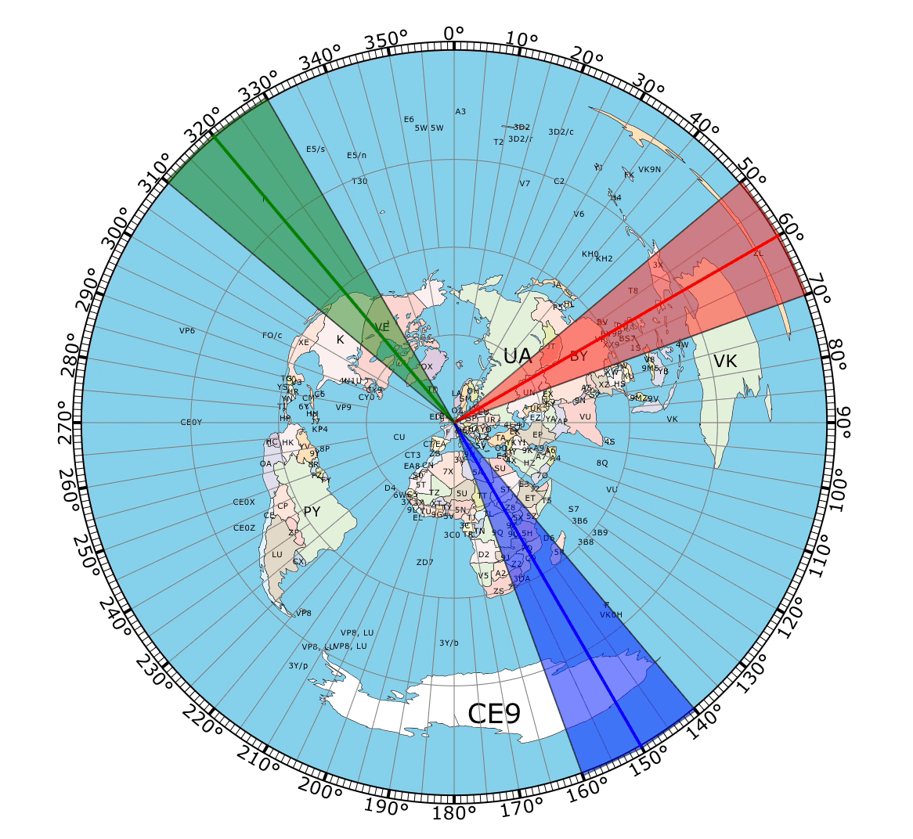
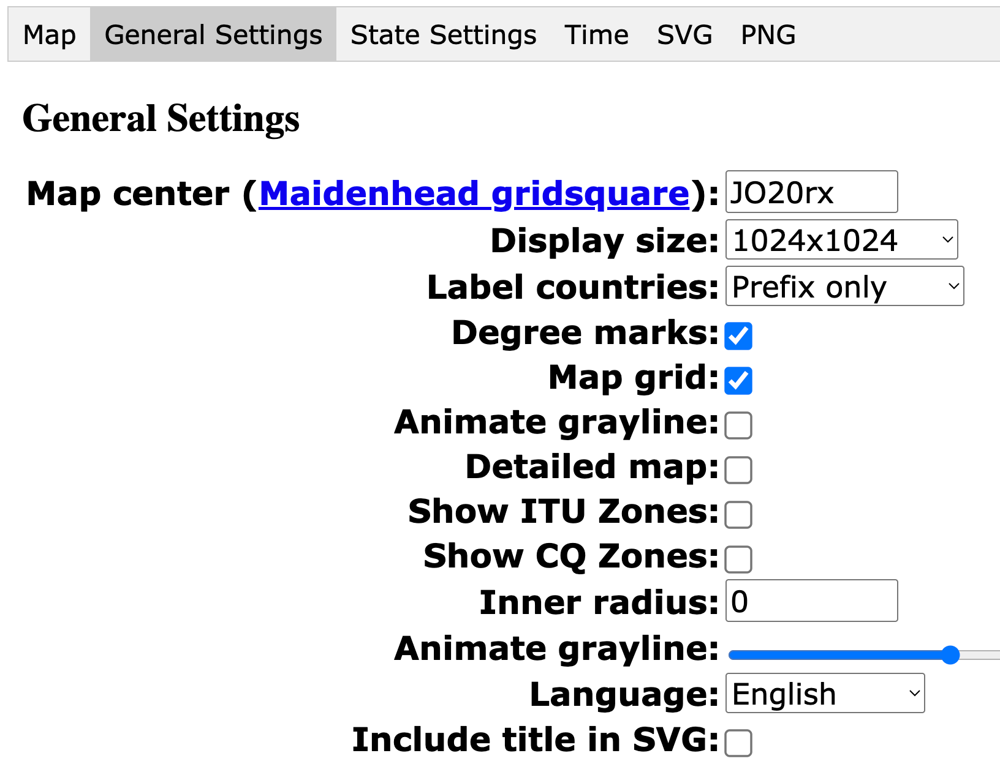

# on4ff-node-red-rotor-map

Map display of multiple rotor/beam headings compatible with Node Red Dashboard v2.

This is a rewrite of the classic well known rotor beam map display which was only compatible with Node-Red Dashboard v1 and which only showed one beam heading.

The flow currently contains 3 beam headings as a demo but you can remove beams as you wish by slightly modifying the flow or adding beams by adding them in the code similar to the other beams.

## Custom maps

Create your own custom map background on the [site of NS6T](https://ns6t.net/AzShadowMap/experimental.html).

The settings I used were:

